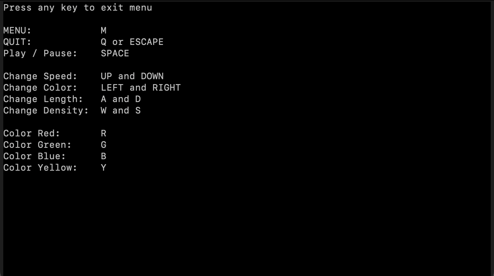
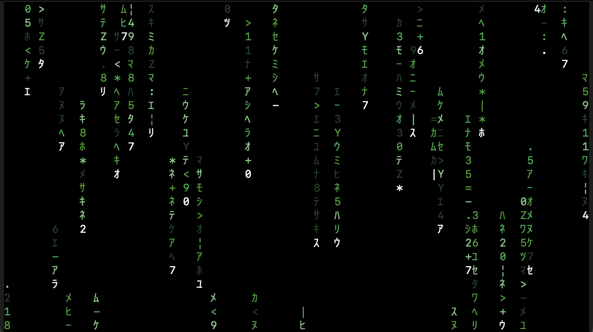
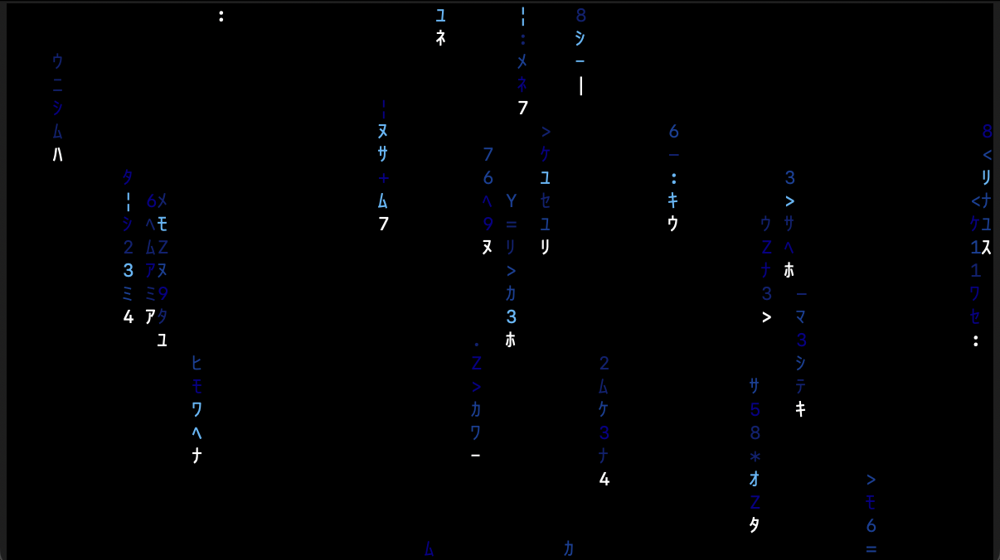
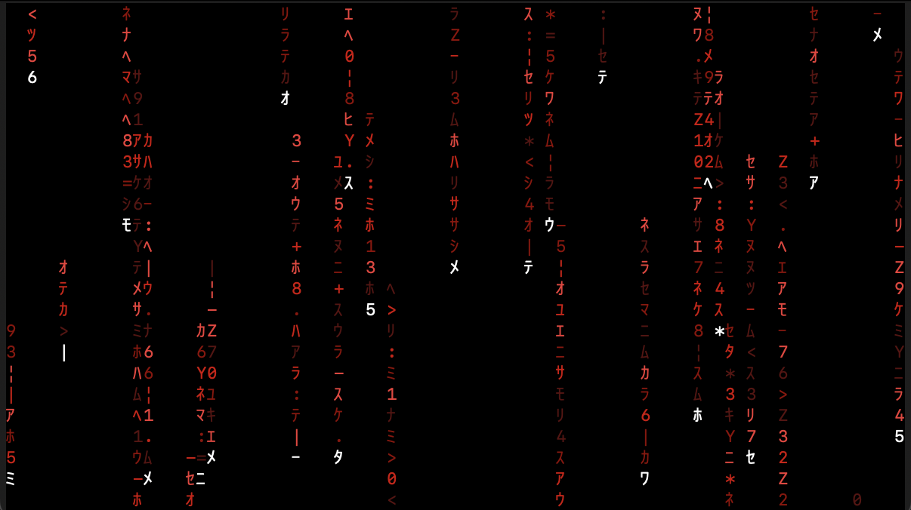

### Compile Instructions
```clang main.c -lncurses```  
or if using curses, change the header to curses.h and  
```clang main.c -lcurses```  

### Python Instructions
just run the code, note that the Python version is subpar to the C version







